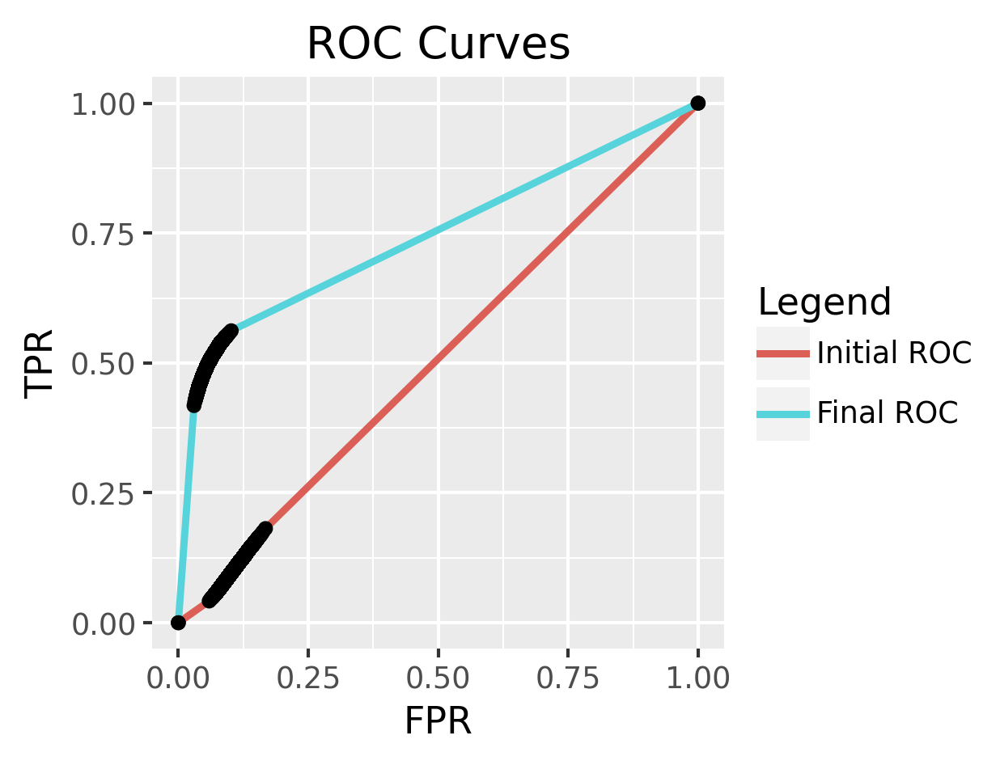

# [AUM](https://www.jmlr.org/papers/v24/21-0751.html) Multi-class

## 1. Introduction

In this repository, I aim to tackle the problem of optimizing the ROC AUC in the context of multiclass classification. The approach used is One-vs-All (OvA), where the multiclass problem is reduced to multiple binary classification problems.

## 2. ROC (Receiver Operating Characteristic) *(The code in this part was inspired by [this blog](https://tdhock.github.io/blog/2024/torch-roc-aum/))*

I began this repo by implementing the code necessary to generate ROC curves, using micro-averaging to aggregate the True Positive Rates (TPRs) and False Positive Rates (FPRs) from the OvA classifiers. I visualized it using a simple dataset with 4 labels, 3 classes and 1 feature 

  

## 3. A first model : linear classifier
I trained a linear classifier using MNIST data using AUM as a loss function ( micro-averaging the OvA AUM) , I then drew the ROC curve before and after training.The ROC AUC seems to increase when the AUM decreases, but the distribution of the points in the ROC curve seems a bit weird ( as FPR jumps from 0.1 to 1 ):

  

